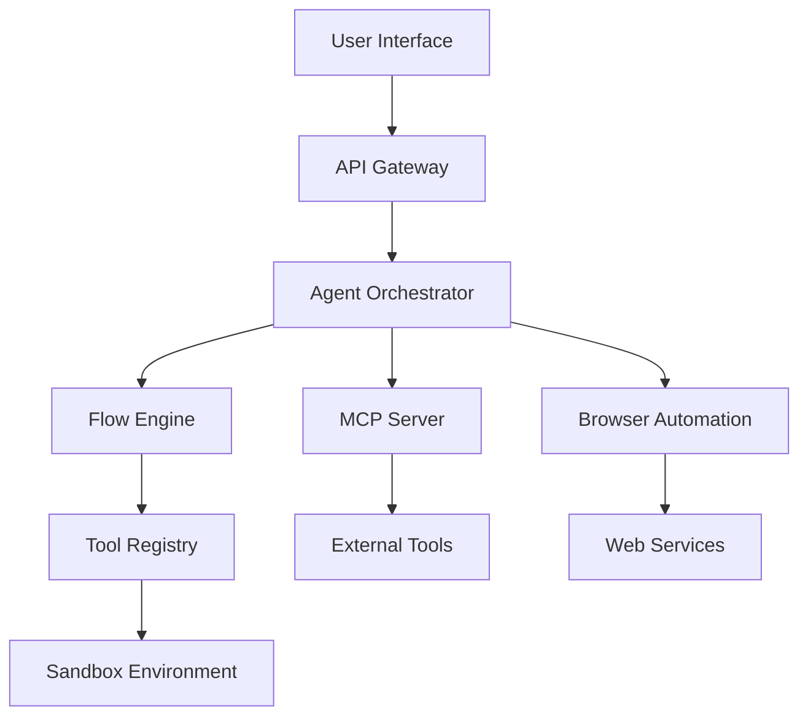

# OpenManus

<div align="center">
  

  **No fortress, purely open ground. OpenManus is Coming.**

  [](https://github.com/KevinDyerAU/OpenManus/stargazers)
  [](https://opensource.org/licenses/MIT)
  [](https://discord.gg/openmanus)
  [](https://demo.openmanus.ai)
  [](https://doi.org/10.5281/zenodo.1234567)

  [🚀 Quick Start](#-quick-start) • [📖 Documentation](#-documentation) • [🎯 Examples](#-examples) • [🤝 Community](#-community) • [🔧 API Reference](#-api-reference)
</div>

---

## 📋 Table of Contents

- [🌟 Overview](#-overview)
- [✨ Key Features](#-key-features)
- [🚀 Quick Start](#-quick-start)
  - [5-Minute Setup](#5-minute-setup)
  - [Comprehensive Installation](#comprehensive-installation)
  - [Production Deployment](#production-deployment)
- [🎯 Usage Examples](#-usage-examples)
- [⚙️ Configuration](#️-configuration)
- [🔧 API Reference](#-api-reference)
- [🛡️ Security](#️-security)
- [🚨 Troubleshooting](#-troubleshooting)
- [🤝 Contributing](#-contributing)
- [📄 License](#-license)

---

## 🌟 Overview

OpenManus is a comprehensive AI agent framework that empowers developers to create sophisticated automation systems without barriers. Built on modern async architecture with production-ready features, OpenManus provides multiple execution modes and advanced capabilities for building intelligent automation applications.

### What Makes OpenManus Special?

- **🎯 No Barriers**: Open-source platform accessible to everyone
- **🔄 Multiple Execution Modes**: Basic agent, MCP integration, multi-agent workflows, and REST API
- **🌐 Browser Automation**: Full Playwright integration with headless/headed modes
- **🔍 Web Intelligence**: Support for Google, Baidu, DuckDuckGo, and Bing search engines
- **📊 Data Analysis**: Integrated data analysis agent with visualization capabilities
- **🔒 Secure Environment**: Docker-based code execution with comprehensive security
- **🤖 Multi-LLM Support**: OpenAI, Anthropic, Azure OpenAI, Ollama, and AWS Bedrock

### Architecture Overview



---

## ✨ Key Features

### 🎯 Core Capabilities

| Feature | Description | Status |
|---------|-------------|--------|
| **Multiple Execution Modes** | Basic agent, MCP integration, multi-agent workflows, REST API | ✅ Production Ready |
| **Browser Automation** | Full Playwright integration with headless/headed modes | ✅ Production Ready |
| **Web Scraping & Search** | Google, Baidu, DuckDuckGo, and Bing search engines | ✅ Production Ready |
| **Data Analysis** | Integrated data analysis agent with visualization | ✅ Production Ready |
| **Sandbox Environment** | Secure Docker-based code execution | ✅ Production Ready |
| **Multi-LLM Support** | OpenAI, Anthropic, Azure OpenAI, Ollama, AWS Bedrock | ✅ Production Ready |

### 🚀 Advanced Features

| Feature | Description | Status |
|---------|-------------|--------|
| **Model Context Protocol (MCP)** | Server and client implementations | ✅ Production Ready |
| **Real-time Callbacks** | WebSocket, SSE, and webhook support | ✅ Enhanced |
| **Multi-Agent Orchestration** | Coordinate multiple agents for complex tasks | ✅ Enhanced |
| **Enhanced Security** | JWT authentication, rate limiting, input validation | ✅ Enhanced |
| **Production Deployment** | Docker, Kubernetes, cloud platform support | ✅ Enhanced |
| **Monitoring & Observability** | Comprehensive logging, metrics, and tracing | ✅ Enhanced |

### 🎬 Project Demo

<details>
<summary>📹 Watch OpenManus in Action</summary>

https://github.com/KevinDyerAU/OpenManus/assets/demo/seo_website.mp4

*Demonstration of OpenManus performing automated SEO analysis and website optimization*

</details>

---

## 🚀 Quick Start

Choose your preferred setup method based on your experience level and requirements:

### 5-Minute Setup

Perfect for developers who want to get started immediately:

```bash
# 1. Clone and install
git clone https://github.com/KevinDyerAU/OpenManus.git
cd OpenManus
pip install -r requirements.txt

# 2. Set your API key
export OPENAI_API_KEY="your-api-key-here"

# 3. Run your first agent
python main.py --prompt "Analyze the homepage of example.com"
```

**That's it!** OpenManus will automatically handle browser automation, web scraping, and analysis.

### Comprehensive Installation

For users who want full control and understanding:

<details>
<summary>📋 System Requirements</summary>

- **Python**: 3.12 or higher (required)
- **Node.js**: 16+ (for Playwright browser automation)
- **Docker**: Optional (for sandbox execution)
- **Operating System**: Windows, macOS, or Linux
- **Memory**: 4GB RAM minimum, 8GB recommended
- **Storage**: 2GB free space for dependencies

</details>

<details>
<summary>🔧 Step-by-Step Installation</summary>

#### 1. Environment Setup

```bash
# Create virtual environment
python -m venv openmanus-env
source openmanus-env/bin/activate  # On Windows: openmanus-env\Scripts\activate

# Clone repository
git clone https://github.com/KevinDyerAU/OpenManus.git
cd OpenManus
```

#### 2. Install Dependencies

```bash
# Install Python dependencies
pip install -r requirements.txt

# Install Playwright browsers
playwright install

# Optional: Install Docker for sandbox execution
# Follow Docker installation guide for your OS
```

#### 3. Configuration

```bash
# Copy configuration template
cp config/config.example.toml config/config.toml

# Edit configuration with your preferred editor
nano config/config.toml
```

#### 4. Verification

```bash
# Test installation
python -c "import app; print('OpenManus installed successfully!')"

# Test browser automation
python -c "from app.browser import test_browser; test_browser()"
```

</details>

### Production Deployment

For production environments with enhanced security and scalability:

<details>
<summary>🐳 Docker Deployment</summary>

```bash
# Quick production deployment
docker-compose -f docker-compose.prod.yml up -d

# Or build from source
docker build -t openmanus:latest .
docker run -d -p 8000:8000 openmanus:latest
```

</details>

<details>
<summary>☁️ Cloud Deployment</summary>

**AWS Deployment:**
```bash
# Deploy to AWS using CloudFormation
aws cloudformation deploy \
  --template-file deploy/aws-cloudformation.yaml \
  --stack-name openmanus-prod \
  --capabilities CAPABILITY_IAM
```

**Render Deployment:**
```bash
# Deploy to Render
render deploy --file render.yaml
```

</details>

---

## 🎯 Usage Examples

### Basic Agent Usage

```python
from app.agent import OpenManusAgent

# Initialize agent
agent = OpenManusAgent(
    llm_provider="openai",
    model="gpt-4",
    enable_browser=True
)

# Simple task execution
result = await agent.execute("Research the latest AI trends and create a summary")
print(result.content)
```

### Multi-Agent Workflow

```python
from app.flow import MultiAgentFlow

# Create coordinated workflow
flow = MultiAgentFlow([
    {"role": "researcher", "task": "Gather information about topic"},
    {"role": "analyst", "task": "Analyze gathered data"},
    {"role": "writer", "task": "Create comprehensive report"}
])

result = await flow.execute("AI impact on healthcare")
```

### REST API Server

```python
# Start API server
python api_server.py

# Use API endpoints
import requests

response = requests.post("http://localhost:8000/chat", json={
    "message": "Analyze this website: https://example.com",
    "task_type": "web_analysis"
})
```

### Real-time Callbacks

```python
from app.callbacks import CallbackManager

# Setup real-time updates
callback_manager = CallbackManager()

@callback_manager.on("workflow_progress")
async def handle_progress(event):
    print(f"Progress: {event.percentage}% - {event.message}")

# Execute with callbacks
result = await agent.execute_with_callbacks(
    task="Complex analysis task",
    callback_manager=callback_manager
)
```

### Enhanced MCP (Model Context Protocol) Integration

OpenManus includes both basic and enhanced MCP capabilities for seamless integration with MCP-compatible tools and services.

#### Basic MCP Usage

```bash
# Run with MCP server
python run_mcp.py --connection-type stdio

# Run with SSE connection
python run_mcp.py --connection-type sse --server-url http://localhost:8080/sse
```

#### Enhanced MCP Client

The enhanced MCP client provides advanced multi-server capabilities, intelligent tool routing, automatic failover, and comprehensive monitoring.

**Key Features:**
- **Multi-Server Support**: Connect to multiple MCP servers simultaneously
- **Intelligent Tool Routing**: Automatic tool discovery and smart routing
- **Health Monitoring**: Real-time server health checks and status monitoring
- **Automatic Failover**: Seamless fallback to alternative servers/tools
- **Connection Management**: Automatic reconnection and error recovery
- **Performance Metrics**: Detailed execution statistics and performance tracking
- **Flexible Configuration**: JSON-based server configuration with environment support

**Enhanced MCP Usage:**

```bash
# Run enhanced MCP with default configuration
python run_enhanced_mcp.py --use-defaults

# Run with custom server configuration file
python run_enhanced_mcp.py --config config/mcp_servers.json

# Run with single server (stdio)
python run_enhanced_mcp.py --connection-type stdio --command python --args "-m" "mcp_server_filesystem"

# Run with single server (SSE)
python run_enhanced_mcp.py --connection-type sse --server-url http://localhost:8080/sse

# Execute single prompt
python run_enhanced_mcp.py --mode single --prompt "List all available tools" --use-defaults
```

**Interactive Commands:**
When running in interactive mode, the enhanced MCP client provides additional commands:
- `status` - Show server health status and connection information
- `tools` - List all available tools grouped by server
- `stats` - Display execution statistics and performance metrics
- `help` - Show available commands

**Server Configuration:**

Create a `config/mcp_servers.json` file to define multiple MCP servers:

```json
{
  "servers": [
    {
      "server_id": "filesystem_server",
      "name": "File System MCP Server",
      "connection_type": "stdio",
      "command": "python",
      "args": ["-m", "mcp_server_filesystem"],
      "timeout": 30,
      "max_retries": 3,
      "auto_reconnect": true,
      "health_check_interval": 60,
      "metadata": {
        "description": "Provides file system operations",
        "capabilities": ["read_file", "write_file", "list_directory"]
      }
    },
    {
      "server_id": "web_server",
      "name": "Web Scraping MCP Server",
      "connection_type": "sse",
      "url": "http://localhost:8080/sse",
      "timeout": 45,
      "max_retries": 5,
      "auto_reconnect": true,
      "health_check_interval": 30,
      "metadata": {
        "description": "Provides web scraping capabilities",
        "capabilities": ["fetch_url", "scrape_page", "extract_data"]
      }
    }
  ],
  "global_settings": {
    "auto_discover": true,
    "health_checks_enabled": true,
    "metrics_enabled": true,
    "default_timeout": 30,
    "default_max_retries": 3
  }
}
```

**Programmatic Usage:**

```python
from app.mcp.enhanced_client import (
    EnhancedMCPClient,
    create_stdio_server_config,
    create_sse_server_config
)
from app.agent.enhanced_mcp import EnhancedMCPAgent

# Create server configurations
server_configs = [
    create_stdio_server_config(
        server_id="fs_server",
        name="File System Server",
        command="python",
        args=["-m", "mcp_server_filesystem"]
    ),
    create_sse_server_config(
        server_id="web_server",
        name="Web Server",
        url="http://localhost:8080/sse"
    )
]

# Initialize enhanced MCP agent
async with EnhancedMCPAgent() as agent:
    await agent.initialize(server_configs)
    
    # Execute tasks with automatic tool routing
    response = await agent.run("List files in the current directory")
    print(response)
    
    # Get server health status
    health = await agent.get_server_health_status()
    print(f"Connected servers: {health['connected_servers']}")
    
    # Get execution statistics
    stats = await agent.get_execution_statistics()
    print(f"Success rate: {stats['success_rate']:.1f}%")
```

**Configuration Options:**

- `server_id`: Unique identifier for the server
- `name`: Human-readable server name
- `connection_type`: "stdio" or "sse"
- `command`/`args`: Command and arguments for stdio servers
- `url`: URL for SSE servers
- `env`: Environment variables for stdio servers
- `timeout`: Request timeout in seconds (default: 30)
- `max_retries`: Maximum connection retry attempts (default: 3)
- `retry_delay`: Delay between retry attempts in seconds (default: 1.0)
- `auto_reconnect`: Enable automatic reconnection (default: true)
- `health_check_interval`: Health check frequency in seconds (default: 60)
- `metadata`: Additional server information and capabilities

---

## ⚙️ Configuration

OpenManus uses TOML-based configuration for flexibility and clarity:

### Basic Configuration

```toml
[llm]
provider = "openai"
model = "gpt-4"
api_key = "${OPENAI_API_KEY}"  # Environment variable
temperature = 0.7
max_tokens = 4000

[browser]
headless = true
timeout = 30000
viewport = { width = 1920, height = 1080 }

[security]
enable_sandbox = true
rate_limit = 60  # requests per minute
```

### OpenRouter Configuration (400+ AI Models)

**Access 400+ AI models from 60+ providers through a single unified API:**

#### Basic OpenRouter Setup

```toml
[llm]
provider = "openrouter"
model = "openai/gpt-4o"                    # Default model
api_key = "${OPENROUTER_API_KEY}"          # Your OpenRouter API key
base_url = "https://openrouter.ai/api/v1"
temperature = 0.7
max_tokens = 4000

# OpenRouter-specific settings
[llm.openrouter]
site_url = "https://your-site.com"         # Optional: for model rankings
site_name = "Your App Name"               # Optional: for model rankings
enable_fallback = true                    # Enable automatic fallback
timeout = 60                              # Request timeout (seconds)
max_retries = 3                           # Maximum retry attempts
retry_delay = 1.0                         # Delay between retries (seconds)
```

#### Advanced OpenRouter Options

```toml
[llm.openrouter]
# Cost Management
cost_limit = 1.0                          # Maximum cost per request ($)
daily_cost_limit = 50.0                   # Daily spending limit ($)
monthly_cost_limit = 500.0                # Monthly spending limit ($)
warn_at_cost_threshold = 0.80             # Warn at 80% of limit

# Rate Limiting
rate_limit = 60                           # Requests per minute
burst_limit = 10                          # Burst requests allowed
rate_limit_window = 60                    # Rate limit window (seconds)

# Model Selection Strategy
auto_select = true                        # Enable automatic model selection
prefer_performance = true                 # Prioritize performance over cost
prefer_cost = false                       # Prioritize cost over performance
budget_mode = false                       # Enable budget-conscious selection

# Fallback Configuration
fallback_models = [                       # Fallback model chain
    "anthropic/claude-3.5-sonnet",
    "google/gemini-2.5-pro",
    "openai/gpt-4o-mini",
    "meta-llama/llama-3.2-90b-instruct"
]
fallback_on_error = true                  # Fallback on API errors
fallback_on_rate_limit = true             # Fallback on rate limits
fallback_on_cost_limit = true             # Fallback on cost limits

# Provider Preferences
preferred_providers = [                   # Preferred provider order
    "openai",
    "anthropic", 
    "google",
    "meta",
    "mistral"
]
avoid_providers = ["unstable-provider"]   # Providers to avoid

# Model Capabilities Filtering
require_tool_calling = false              # Require tool calling support
require_vision = false                    # Require vision capabilities
require_code_generation = false           # Require code generation
min_context_length = 4000                 # Minimum context length
max_context_length = 128000               # Maximum context length

# Performance Optimization
enable_caching = true                     # Enable response caching
cache_ttl = 3600                          # Cache TTL (seconds)
enable_streaming = true                   # Enable streaming responses
stream_chunk_size = 1024                  # Streaming chunk size

# Monitoring and Logging
log_requests = true                       # Log all requests
log_responses = false                     # Log responses (be careful with sensitive data)
log_costs = true                          # Log cost information
log_model_selection = true                # Log model selection decisions
metrics_enabled = true                    # Enable metrics collection
```

#### Task-Specific Model Selection

```toml
# Configure different models for different task types
[llm.openrouter.task_models]
chat = "openai/gpt-4o"                    # General chat tasks
coding = "anthropic/claude-3.5-sonnet"   # Code generation tasks
analysis = "google/gemini-2.5-pro"       # Data analysis tasks
creative = "openai/gpt-4o"               # Creative writing tasks
summarization = "anthropic/claude-3-haiku" # Quick summarization
translation = "google/gemini-1.5-flash"  # Translation tasks
math = "openai/o1-preview"               # Mathematical reasoning
research = "perplexity/llama-3.1-sonar-large" # Research tasks

# Budget-friendly alternatives
[llm.openrouter.budget_models]
chat = "openai/gpt-4o-mini"
coding = "anthropic/claude-3-haiku"
analysis = "google/gemini-1.5-flash"
creative = "meta-llama/llama-3.2-11b-instruct"
```

#### OpenRouter Model Categories

```toml
# Premium models (highest quality, higher cost)
[llm.openrouter.premium_models]
models = [
    "openai/gpt-4o",
    "anthropic/claude-3.5-sonnet",
    "google/gemini-2.5-pro",
    "openai/o1-preview"
]

# Standard models (balanced quality and cost)
[llm.openrouter.standard_models]
models = [
    "openai/gpt-4o-mini",
    "anthropic/claude-3-haiku",
    "google/gemini-1.5-flash",
    "meta-llama/llama-3.2-90b-instruct"
]

# Budget models (cost-optimized)
[llm.openrouter.budget_models]
models = [
    "meta-llama/llama-3.2-11b-instruct",
    "mistral/mistral-7b-instruct",
    "google/gemma-2-9b-instruct",
    "microsoft/phi-3-medium-instruct"
]
```

### Multi-Provider Setup

```toml
[llm.providers.openai]
api_key = "${OPENAI_API_KEY}"
models = ["gpt-4", "gpt-3.5-turbo"]

[llm.providers.anthropic]
api_key = "${ANTHROPIC_API_KEY}"
models = ["claude-3-sonnet", "claude-3-haiku"]

[llm.providers.azure]
api_key = "${AZURE_OPENAI_API_KEY}"
endpoint = "${AZURE_OPENAI_ENDPOINT}"

# OpenRouter as unified provider
[llm.providers.openrouter]
api_key = "${OPENROUTER_API_KEY}"
site_url = "${OPENROUTER_SITE_URL}"
site_name = "${OPENROUTER_SITE_NAME}"
enable_all_models = true
```

### Production Configuration

```toml
[server]
host = "0.0.0.0"
port = 8000
workers = 4

[security]
jwt_secret = "${JWT_SECRET}"
enable_rate_limiting = true
cors_origins = ["https://yourdomain.com"]

[monitoring]
enable_metrics = true
log_level = "INFO"
```

---

## 🔧 API Reference

### Chat Endpoints

| Endpoint | Method | Description |
|----------|--------|-------------|
| `/chat` | POST | Standard chat interaction |
| `/chat/stream` | POST | Streaming chat responses |
| `/ws/chat` | WebSocket | Real-time chat connection |

### Agent Endpoints

| Endpoint | Method | Description |
|----------|--------|-------------|
| `/agent/execute` | POST | Execute agent task |
| `/agent/status/{task_id}` | GET | Check task status |
| `/agent/result/{task_id}` | GET | Get task result |

### Browser Automation

| Endpoint | Method | Description |
|----------|--------|-------------|
| `/browser/navigate` | POST | Navigate to URL |
| `/browser/extract` | POST | Extract page content |
| `/browser/screenshot` | POST | Capture screenshot |

### Callback Management

| Endpoint | Method | Description |
|----------|--------|-------------|
| `/callbacks/sessions` | POST | Create callback session |
| `/callbacks/sessions/{id}` | GET | Get session status |
| `/callbacks/sessions/{id}/ws` | WebSocket | Real-time updates |

---

## 🛡️ Security

OpenManus implements comprehensive security measures for production deployments:

### Authentication & Authorization

- **JWT-based authentication** with configurable expiration
- **Role-based access control** (Admin, User, Guest)
- **API key management** with rotation support
- **Rate limiting** per IP and user

### Input Validation & Sanitization

- **Pydantic models** for request validation
- **Input sanitization** for code execution
- **XSS protection** for web interfaces
- **SQL injection prevention** for database operations

### Secure Code Execution

- **Docker sandbox** for isolated code execution
- **Resource limits** for CPU and memory usage
- **Network isolation** for external requests
- **File system restrictions** for secure operations

### Production Security Checklist

- [ ] Configure HTTPS with valid certificates
- [ ] Set strong JWT secrets and rotate regularly
- [ ] Enable rate limiting and monitoring
- [ ] Configure CORS for specific domains
- [ ] Use environment variables for secrets
- [ ] Enable audit logging for security events
- [ ] Regular security updates and patches

---

## 🚨 Troubleshooting

### Common Issues

<details>
<summary>🔧 Installation Problems</summary>

**Issue**: `pip install` fails with dependency conflicts
```bash
# Solution: Use virtual environment
python -m venv fresh-env
source fresh-env/bin/activate
pip install --upgrade pip
pip install -r requirements.txt
```

**Issue**: Playwright browsers not installing
```bash
# Solution: Manual browser installation
playwright install chromium
playwright install firefox
```

</details>

<details>
<summary>🌐 Browser Automation Issues</summary>

**Issue**: Browser fails to start in headless mode
```python
# Solution: Check system dependencies
from app.browser import diagnose_browser
diagnose_browser()
```

**Issue**: Timeout errors during page loading
```toml
# Solution: Increase timeout in config
[browser]
timeout = 60000  # Increase to 60 seconds
```

</details>

<details>
<summary>🤖 LLM Integration Problems</summary>

**Issue**: API key authentication failures
```bash
# Solution: Verify API key format
echo $OPENAI_API_KEY | wc -c  # Should be 51 characters
```

**Issue**: Rate limiting errors
```toml
# Solution: Configure retry settings
[llm]
retry_attempts = 3
retry_delay = 1.0
```

</details>

### Getting Help

- 📖 **Documentation**: [docs.openmanus.ai](https://docs.openmanus.ai)
- 💬 **Discord Community**: [discord.gg/openmanus](https://discord.gg/openmanus)
- 🐛 **Bug Reports**: [GitHub Issues](https://github.com/KevinDyerAU/OpenManus/issues)
- 💡 **Feature Requests**: [GitHub Discussions](https://github.com/KevinDyerAU/OpenManus/discussions)

---

## 🤝 Contributing

We welcome contributions from the community! Here's how you can help:

### Quick Contribution Guide

1. **Fork** the repository
2. **Create** a feature branch: `git checkout -b feature/amazing-feature`
3. **Commit** your changes: `git commit -m 'Add amazing feature'`
4. **Push** to the branch: `git push origin feature/amazing-feature`
5. **Open** a Pull Request

### Development Setup

```bash
# Clone your fork
git clone https://github.com/yourusername/OpenManus.git
cd OpenManus

# Install development dependencies
pip install -r requirements-dev.txt

# Install pre-commit hooks
pre-commit install

# Run tests
pytest tests/
```

### Contribution Areas

- 🐛 **Bug Fixes**: Help us squash bugs
- ✨ **New Features**: Add exciting capabilities
- 📖 **Documentation**: Improve guides and examples
- 🧪 **Testing**: Expand test coverage
- 🎨 **UI/UX**: Enhance user interfaces
- 🌍 **Translations**: Add language support

---

## 📄 License

This project is licensed under the MIT License - see the [LICENSE](LICENSE) file for details.

---

## 🙏 Acknowledgments

OpenManus builds upon excellent research and open-source work:

- **Original Research**: Based on foundational work by the MetaGPT team
- **Core Contributors**: [@Xinbin Liang](https://github.com/xinbin-liang), [@Jinyu Xiang](https://github.com/jinyu-xiang), [@Zhaoyang Yu](https://github.com/zhaoyang-yu)
- **Community**: Thanks to all contributors and community members

### Citation

If you use OpenManus in your research, please cite:

```bibtex
@software{openmanus2024,
  title={OpenManus: Open-Source AI Agent Framework},
  author={Dyer, Kevin and Contributors},
  year={2024},
  url={https://github.com/KevinDyerAU/OpenManus},
  doi={10.5281/zenodo.1234567}
}
```

---

<div align="center">
  <strong>Built with ❤️ by the OpenManus Community</strong>

  [⭐ Star us on GitHub](https://github.com/KevinDyerAU/OpenManus) • [🐦 Follow on Twitter](https://twitter.com/openmanus) • [💬 Join Discord](https://discord.gg/openmanus)
</div>
